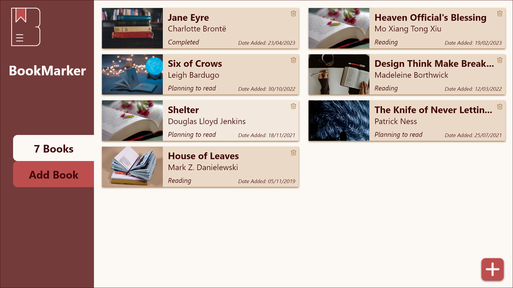
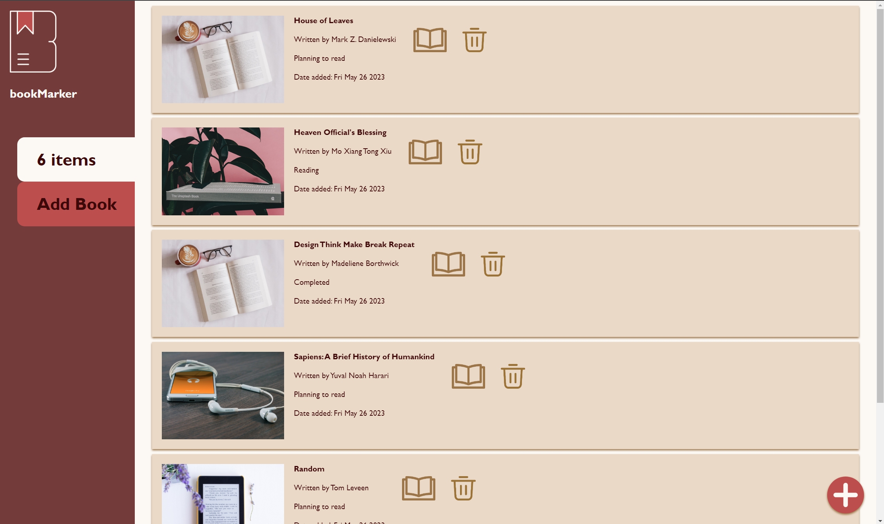
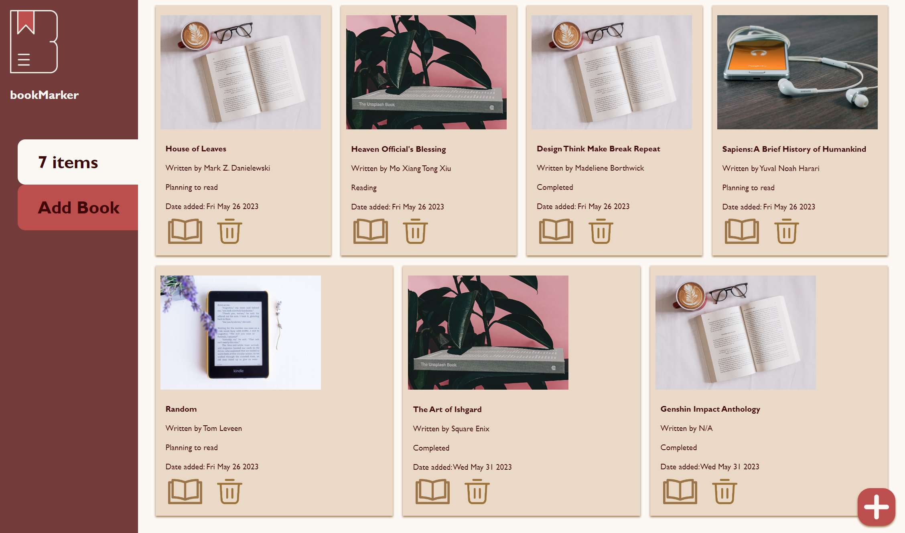
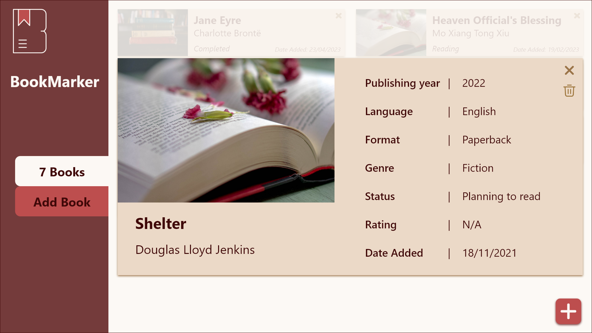
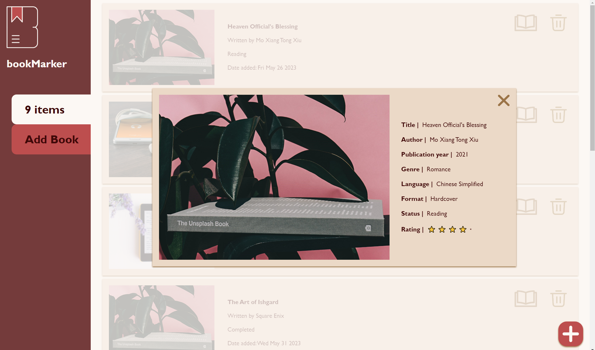
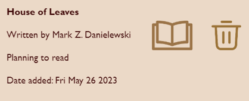
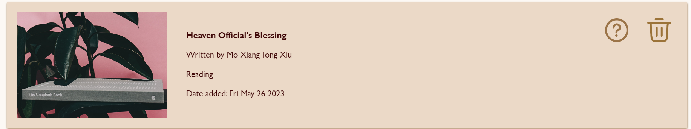

# DECO2017 Assignment 3 - Book Tracker
I logged in on the wrong account at one point, sorry.

## Deployment procedures
1. Run `npm install`
2. Run `npm run dev`
3. View on http://localhost:1234/

## To-Do [Delete later]
- responsiveness for mobile

## Iteration and implementation
### General method of approach
1. Formed a basic HTML layout, containing the sidebar and the form's input and selection options
2. Added JavaScript to create the action of using the tracking form with a floating action button in the bottom right corner
3. Using example items added to an array in JS, styled the visuals of each item in the tracking app with CSS
4. Implemented the use of localstorage in JS to save user's tracked items on the browser
5. Most of the CSS styling was applied later, along with a responsive mobile version

### Creating the pop-up form
1. Wrote out the HTML for all the form elements
2. General CSS for spacing of input boxes
3. Scripted the 'Add book' and 'Cancel' buttons
4. localstorage and JSON parsing is now working; items are saved on the browser
5. CSS for the pop up form was updated; now includes an opaque div for a background blur to accentuate the form's presence on the screen

### Home Page

Mockup of the home page design, featuring columns of books added to the tracker
<br>


Screenshot of the current working prototype's home page. This was done using `display: block` and does not accurately reflect the mockups
<br>


A screenshot of the web app using `display: flex` on the container that displays all the books in the tracker. The CSS code required to make this version of display work is as follows:
```css
#bookList {
    display: flex;
    flex-flow: row wrap;
    justify-content: space-evenly;
}

/* for each item in the list, it displays a rectangle section */
#bookList > div {
    list-style-type: none;
    background-color: #EBD9C7;
    padding: 10px 10px;
    margin: 10px;
    filter: drop-shadow(0px 3px 2px #997245);
    flex-wrap: wrap;
    flex-grow: 1;
    width: 300px;
    height: 500px;
    justify-content: center;
}
```
This is more accurate to my proposed designs and was much more suitable for making use of the available space on the web page, however the nature of flexbox made it difficult to have a consistent style for each book being displayed, as you can see with the bottom row of items having a wider width than the top row of items. Due to this inconsistency, I chose to use `display: block` for the tracker's display to have a much more consistent styling.

### Viewing more information

A mockup of the proposed design for viewing all the information available about a tracked item.


A screenshot of the current working prototype of the in-depth information display about a book the user clicks on. Due to some limitations with eventlisteners in JavaScript, I was not able to make the book information viewable with a simple click of the item, as the eventlistener will confuse clicking the delete button with clicking the item to view; for this reason, I added the view button (represented by a question icon) for users to click when they want to see more information.
<br>


> The old view icon
<br>


> The current view icon
<br>

Originally, I used a book icon to represent the option to view more information, however, this intention may not be effectively conveyed to the user. Due to this possible confustion, I opted to use the question mark icon due to its more familiar design language that indicates where users should click to find out more information about something on a webpage.

The current version of the information view takes up less screen space on the web page, with the intention being to make it less confronting for users to suddenly see a large pop-up on their screen, as well as keep the information more compact and readable by the eyes. The star emojis were added to the rating's heading as a better visual representation of the user's rating of a book.

The background blur to create contrast with the other elements on the page was achieved with a `<div>` that is by default not displayed, and can only be activated by the view button or when opening the form. Note that the floating action button is still clickable in the view state, as a shortcut for users that wish to add more books at any time.

### Adding books with the form
- form is a lot smaller than proposed in the mockups

### Deleting books from the tracker
- rather than creating my own pop-up, I utilised the existing window alerts for browsers: Why?

## Testing
**Optimal screen size for viewing**
<br>
Desktop: 1920 x 1080
<br>
Mobile: 412 x 915 (Samsung Galaxy S20 Ultra in Google Chrome Developer Tools)

### Browsers used for testing and viewing
- Google Chrome
- Microsoft Edge

### Screen sizes used during development
- Laptop screen: 1920 x 1080
- PC monitor: 3840 x 2160 (note: some CSS does not work with this screen size)
- Mobile screen: 650 x 1900 (Using Chrome Developer Tools)

## Potential improvements
- Webpage is not completely responsive outside of the optimal laptop screen and mobile screen; CSS styling issues persisted with using relative values
- Not including a delete button in the in-depth view of the item for the user's convenience
- A delete button could be implemented to the in-depth view for ease of access
- Was not able to shrink the container that displays each book, such that there are 2 columns to make use of the blank space
- Wasn't able to get clicking on the item itself to view the item working; using a view button as a work around
- Due to time constraints for this assignment, thumbnails were determined by the format of the book being added to the tracker rather than using the genres; there were just too many genres to count
- Using a book cover API to generate the books' thumbnails rather than being determined by genre
- Changing the sidebar to be more responsive by using view width and height; had difficulties with formatting the list display to respond the same as the sidebar
- A more extensive list of languages, sourced from https://www.dynamiclanguage.com/list-of-languages/ but the time constraints for this code haven't allowed me to integrate that list 

## Reference List (APA 7th)

Agency, T. (2018). _flat lay photography of opened book_. [Photograph]. unsplash.com. https://unsplash.com/photos/Q8otix2SVko 

Burden, A. (2017). _space gray iPhone 6 on book near black wireless headphones_. [Photograph]. unsplash.com. https://unsplash.com/photos/v0HbU2CNJFs 

Fadhli, K. (2023, January 21). _Trash_. The Noun Project. https://thenounproject.com/icon/trash-5519944/ 

Firmbee. (2015). _white samsung android smartphone turned beside white earbuds on brown board_. [Photograph]. unsplash.com. https://unsplash.com/photos/TMOeGZw9NY4 

Harms, N. (2022). Top 10 Book Formats All Writers Should Know. _Become a Writer Today_. https://becomeawritertoday.com/book-formats/

_How To Create a Fixed Sidebar_. (n.d.). https://www.w3schools.com/howto/howto_css_fixed_sidebar.asp

_How To Create a Popup Form With CSS_. (n.d.). https://www.w3schools.com/howto/howto_js_popup_form.asp

_How To Hide Arrows From Number Input_. (n.d.). https://www.w3schools.com/howto/howto_css_hide_arrow_number.asp

Klutsch, B. (2019). _pile of books_. [Photograph]. unsplash.com. https://unsplash.com/photos/nE2HV5AUXFo 

Lobachev, S. (2008). _Lobachev_. https://journal.lib.uoguelph.ca/index.php/perj/article/view/826/1358

Media, S. (2018). _book near eyeglasses and cappuccino_. [Photograph]. unsplash.com. https://unsplash.com/photos/nGrfKmtwv24 

MSEd, M. M. (2022). List of Book Types or Genres. In _YourDictionary_. https://reference.yourdictionary.com/books-literature/different-types-of-books.html

Pujiyono, Y. (2020, January 10). _read_. The Noun Project. https://thenounproject.com/icon/read-3187961/

Shiva. (2020, May 19). _help_. The Noun Project. https://thenounproject.com/icon/help-3565552/

Tutunaru, O. (2020). _black e book reader on white surface_. [Photograph]. unsplash.com. https://unsplash.com/photos/RMgQQntEkWM 

Webb, S. (2016). _The Unsplash book_. [Photograph]. unsplash.com. https://unsplash.com/photos/zy_D9VFVR_g 