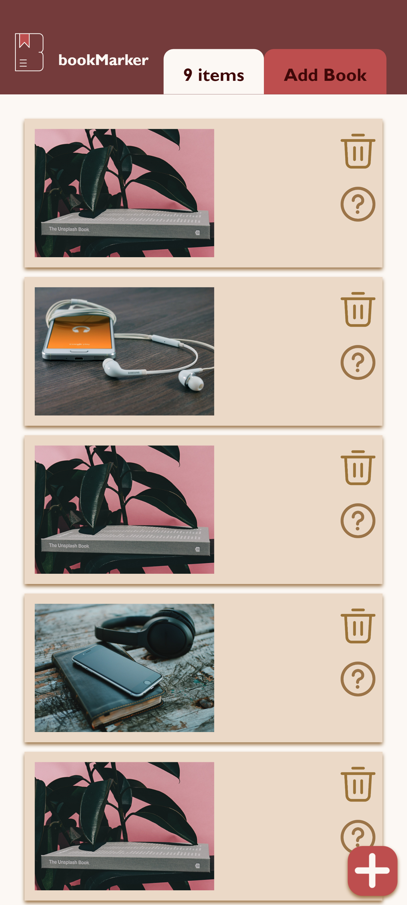

# DECO2017 Assignment 3 - Book Tracker Prototype

## Table of Contents:
1. [Set-up and deployment procedures](#setupAndDeploy)
2. [Testing specifications](#testingSpecs)
3. [Iteration and discussion of implementation](#iteration)
4. [Improvements to be made](#improvements)
5. [Reference list](#referenceList)

## How to set up and deploy on a local machine <a id="setupAndDeploy"></a>
1. Install Node.js
2. Clone the [GitHub repository](https://github.com/vawklee/vlee3645-tracker.git)
3. Using the terminal, run `npm install` to install all dependencies
4. Using the terminal, run `npm run dev` to start the web server
5. View on a web browser at http://localhost:1234/ (port number may vary)

## Testing specifications <a id="testingSpecs"></a>
**Optimal screen sizes for viewing**
<br>
Desktop: 1920 x 1080
<br>
Mobile: 412 x 915 (Samsung Galaxy S20 Ultra in Google Chrome Developer Tools @ 100%)

**Note**: CSS may not have desired effects outside of the optimal screen sizes listed above.

### Browsers used for testing and development
- Google Chrome
- Microsoft Edge

### Screen sizes used during development
- Laptop screen: 1920 x 1080
- PC monitor: 3840 x 2160 (note: CSS may not work optimally with this screen size)
- Mobile screen: 412 x 915 (Using Chrome Developer Tools)

## Iteration and implementation <a id="iteration"></a>
### General method of approach
1. Formed a basic HTML layout, containing the sidebar and the form's input and selection options
2. Added JavaScript to create the action of using the tracking form with a floating action button in the bottom right corner
3. Using example items added to an array in JS, styled the visuals of each item in the tracking app with CSS
4. Implemented the use of localstorage in JS to save user's tracked items on the browser
5. Most of the CSS styling was applied later, along with a responsive mobile version; CSS for visuals was my last priority

### Creating the pop-up form
1. Wrote out the HTML for all the form elements
2. General CSS for spacing of input boxes
3. Scripted the 'Add book' and 'Cancel' buttons
4. localstorage and JSON parsing implemented; items are saved on the browser
5. CSS for the pop up form was updated; now includes an opaque div for a background blur to accentuate the form's presence on the screen

### Home Page
#### DESKTOP

> Mockup of the home page design, featuring columns of books added to the tracker


> Screenshot of the current working prototype's home page. This was done using `display: block` and does not accurately reflect the mockups


A screenshot of the web app using `display: flex` on the container that displays all the books in the tracker. The CSS code required to make this version of display work is as follows:
```css
#bookList {
    display: flex;
    flex-flow: row wrap;
    justify-content: space-evenly;
}

/* for each item in the list, it displays a rectangle section */
#bookList > div {
    list-style-type: none;
    background-color: #EBD9C7;
    padding: 10px 10px;
    margin: 10px;
    filter: drop-shadow(0px 3px 2px #997245);
    flex-wrap: wrap;
    flex-grow: 1;
    width: 300px;
    height: 500px;
    justify-content: center;
}
```
This is more accurate to my proposed designs and was much more suitable for making use of the available space on the web page, however the nature of flexbox made it difficult to have a consistent style for each book being displayed, as you can see with the bottom row of items having a wider width than the top row of items. Due to this inconsistency, I chose to use `display: block` for the tracker's display to have a much more consistent styling.

#### MOBILE

> Original mockup of the mobile version of the book tracker.


> Older version of the mobile prototype; Information and delete buttons are presented in a row within a larger container

The original design featured the view and delete button in a row, however, due to concerns with taking up too much horizontal space on mobile screens, the view and delete buttons were styled with the code snippet below such that they were vertical and allowed for the thumbnail to be showcased to the left:
```css
.buttonContainer {
        display: flex;
        flex-direction: column-reverse;
        margin: 0px;
        position: absolute;
        top: 5px;
        right: 0px;
    }
```


Screenshot of the current working prototype for mobile screens. The appearance of the top 'navigation' bar has drastically changed from the mockup due to my incomplete understanding off CSS. I struggled to find a way to center the coloured tabs at the bottom of the nav bar container and so I opted to keep them to the right side of the logo and webpage title.

The size of the item containers in mobile view has also been changed from a small horizontal rectangle to a larger vertical rectangle. While this takes up more of the screen space and is not optimal for viewing several items at once in the tracker, it better accomodates the paragraph containing the title, author, status and date of tracking. My recreation of a slim horizontal bar without the space to provide quick information is below:


> Slim horizontal container for mobile view that does not have enough space for text

### Viewing more information
#### DESKTOP

> A mockup of the proposed design for viewing all the information available about a tracked item.


A screenshot of the current working prototype of the in-depth information display about a book the user clicks on. Due to some limitations with eventlisteners in JavaScript, I was not able to make the book information viewable with a simple click of the item, as the eventlistener will confuse clicking the delete button with clicking the item to view; for this reason, I added the view button (represented by a question icon) for users to click when they want to see more information.
<br>


> The old view icon


> The current view icon

Originally, I used a book icon to represent the option to view more information, however, this intention may not be effectively conveyed to the user. Due to this possible confustion, I opted to use the question mark icon due to its more familiar design language that indicates where users should click to find out more information about something on a webpage.

The current version of the information view takes up less screen space on the web page, with the intention being to make it less confronting for users to suddenly see a large pop-up on their screen, as well as keep the information more compact and readable by the eyes. The star emojis were added to the rating's heading as a better visual representation of the user's rating of a book.

The background blur to create contrast with the other elements on the page was achieved with a `<div>` that is by default not displayed, and can only be activated by the view button or when opening the form. Note that the floating action button is still clickable in the view state, as a shortcut for users that wish to add more books at any time.

#### MOBILE

> Mockup of the in-depth view of information on mobile screens


The mobile prototype remains largely the same as the mockup, with the main difference being the placement of the close button and removal of the delete button. Rather than placing it next to the paragraph of information about the book, the close view button has been relocated to the top right corner of the container to maintain a consistent design language with the rest of the webpage, as well as keeping the familiar design language of other websites.

### Adding books with the form
#### DESKTOP

> Mockup of the form used to add books


The size of the form has drastically changed from the mockup, with the current working prototype being much smaller and vertical. By doing this with `<br>` linebreaks, it created a much cleaner view and represents the flow of user action down the page towards the submit or cancel button. The smaller size of the form prototype appears less overwhelming to users as they are not surprised with a large bright pop-up when clicking the floating action button. 

Based on tutor feedback, I opted for less colourways in the prototype with clearer colour coding of the cancel button in red to better signify to the users what the buttons do when clicked.

#### MOBILE

> Mockup of the mobile version of the tracking form


Similar to the changes done to the desktop version of this tracking form, there is now a separation of the label and input fields on the mobile prototype to better indicate to the user what information is required as well as providing default selections in the dropdown menu for the most common type of inputs.

### Deleting books from the tracker
#### DESKTOP & MOBILE

> Mockup of the pop-up that confirms the user's action when deleting an item from the tracker


> Screenshot of the in-built browser alert when trying to delete a book

I used `confirm("Are you sure you want to delete this item?\nThis will permanently remove the book from the tracker.")` to create a browser alert pop-up rather than creating my own stylised pop-up due to its ease of implementation. While it would suit the colour theme of the web app much better if there was a pop-up element created in JavaScript, `confirm()` easily verified the user's confirmation (`True`) or cancellation (`False`) when trying to delete a book from the tracker as it would not perform other browser actions until the alert is completed. The use of this in-built browser alert was much smoother than the need for multiple eventlisteners on the cancel and submit buttons created from a stylised pop-up.

## Future improvements <a id="improvements"></a>
- The webpage is not completely responsive outside of the optimal laptop screen and mobile screen listed above; CSS styling issues persisted with using relative values over absolute values
- Implementation of responsive CSS for tablet sized screens; Currently only laptop and mobile screens have responsive css
- A delete button should be included in the in-depth view of a book's information for the user's ease of access, reducing the amount of steps required to delete a book once they view the information
- In the desktop version, the containers that displays each book should be styled to be smaller and more compact such that there are 2 columns to make use of the blank space; possible with the use of flexbox but there are still undesired effects when attempted in this current prototype
- The view button is currently a work around for getting more information about a book; The desired effect was having the user click anywhere on the container to view more information, however the eventlistener confuses a viewing click for a deleting click when clicking the appropriate delete button location
- Due to time constraints for this assignment, thumbnails were determined by the format of the book being added to the tracker rather than using the genres as proposed in my mockups; there were just too many genres to count when inmplementing the tracking form
- A possible solution to the above would be integrating an existing book cover API to generate the books' thumbnails based on their title, rather than generation based on format or genre, or allowing users to import their own images onto the website
- Changing the sidebar to be more responsive by using view width and height; there are some difficulties with formatting the list display to respond the same way as the sidebar as it is currently separated by margins in CSS
- A more extensive list of languages, sourced from https://www.dynamiclanguage.com/list-of-languages/, should be integrated into the tracking form but the time constraints for this assignment as well as the possible length of the dropdown menu has resulted in the use of a list of common literary languages

## Reference List (APA 7th) <a id="referenceList"></a>

Agency, T. (2018). _flat lay photography of opened book_. [Photograph]. unsplash.com. https://unsplash.com/photos/Q8otix2SVko 

Burden, A. (2017). _space gray iPhone 6 on book near black wireless headphones_. [Photograph]. unsplash.com. https://unsplash.com/photos/v0HbU2CNJFs 

Fadhli, K. (2023, January 21). _Trash_. The Noun Project. https://thenounproject.com/icon/trash-5519944/ 

Firmbee. (2015). _white samsung android smartphone turned beside white earbuds on brown board_. [Photograph]. unsplash.com. https://unsplash.com/photos/TMOeGZw9NY4 

Harms, N. (2022). Top 10 Book Formats All Writers Should Know. _Become a Writer Today_. https://becomeawritertoday.com/book-formats/

_How To Create a Fixed Sidebar_. (n.d.). https://www.w3schools.com/howto/howto_css_fixed_sidebar.asp

_How To Create a Popup Form With CSS_. (n.d.). https://www.w3schools.com/howto/howto_js_popup_form.asp

_How To Hide Arrows From Number Input_. (n.d.). https://www.w3schools.com/howto/howto_css_hide_arrow_number.asp

Klutsch, B. (2019). _pile of books_. [Photograph]. unsplash.com. https://unsplash.com/photos/nE2HV5AUXFo 

Lobachev, S. (2008). _Lobachev_. https://journal.lib.uoguelph.ca/index.php/perj/article/view/826/1358

Media, S. (2018). _book near eyeglasses and cappuccino_. [Photograph]. unsplash.com. https://unsplash.com/photos/nGrfKmtwv24 

MSEd, M. M. (2022). List of Book Types or Genres. In _YourDictionary_. https://reference.yourdictionary.com/books-literature/different-types-of-books.html

Pujiyono, Y. (2020, January 10). _read_. The Noun Project. https://thenounproject.com/icon/read-3187961/

Shiva. (2020, May 19). _help_. The Noun Project. https://thenounproject.com/icon/help-3565552/

Tutunaru, O. (2020). _black e book reader on white surface_. [Photograph]. unsplash.com. https://unsplash.com/photos/RMgQQntEkWM 

Webb, S. (2016). _The Unsplash book_. [Photograph]. unsplash.com. https://unsplash.com/photos/zy_D9VFVR_g 
